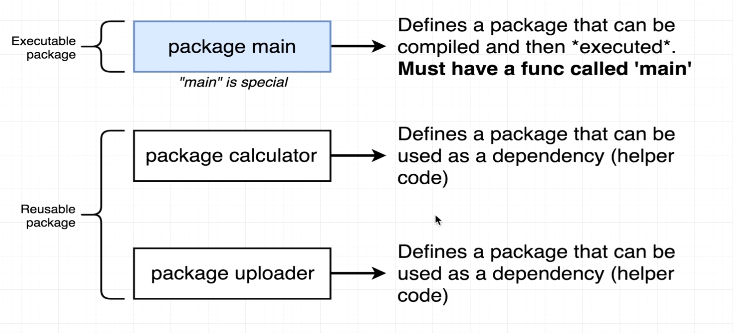

# Go Modules

### What is a module?
Go 1.11 introduced Modules. This approach is the `default build mode` since Go 1.16, therefore the use of `GOPATH` is not recommended.

Modules aim to solve problems related to dependency management, version selection and reproducible builds; they also enable users to run Go code outside of `GOPATH`.


### Types of Packages 
 - Executable := Generates a file that can be executed directly
 - Reusable := code used as helper or reusable logic


  

Using Modules is pretty straightforward. Select any directory outside GOPATH as the root of your project, and create a new module with the *``go mod init``* command.

A go.mod file will be generated, containing 
-  The module path
-  A Go version
-  Dependency requirements, which are the other modules needed for a successful build.

A `go.mod` file could look like this:
```go
//  GO module
module hello

go 1.22.4
```
```output
# command-line-arguments
.\main.go:7:1: syntax error: unexpected package, expected }
```

## Go CLI commands
```shellscript
go build  # compiles go source code files
go run    # compiles and executes go source code files
go fmt    # formats go source code files
go test   # runs tests  
go install # installs a package
go get    # downloads and installs a package
go mod    # manages dependencies
```
```shellscript
# Go Modules

go mod init <module name>
go mod tidy
go mod edit

go mod download
go mod vendor

```

## Writing tests
Writing a test is just like writing a function, with a few rules

- It needs to be in a file with a name like ``xxx_test.go``

- The test function must start with the word ``Test``

- The test function takes one argument only ``t *testing.T``

- To use the ``*testing.T`` type, you need to ``import "testing"``, like we did with ``fmt`` in the other file 

For now, it's enough to know that your `t`of type `*testing.T` is your "hook" into the testing framework so you can do things like ``t.Fail()`` when you want to fail.

